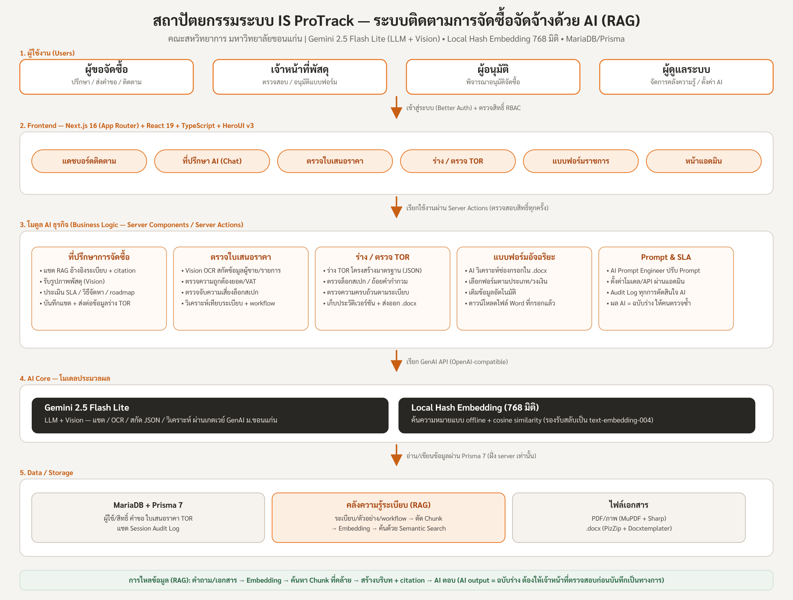

# IS ProTrack

ระบบติดตามการจัดซื้อจัดจ้างด้วย AI (AI Procurement Tracking) ของคณะสหวิทยาการ มหาวิทยาลัยขอนแก่น

---

## 4. แนวทางและขั้นตอนการพัฒนาผลงาน

### เครื่องมือ / โมเดล AI ที่ใช้
- **Frontend:** Next.js 16 (App Router), React 19, TypeScript, Tailwind CSS 4 ร่วมกับ HeroUI v3 (ออกแบบ Mobile-First, ภาษาไทยทั้งหมด)
- **Backend / Data:** Next.js Server Actions + Server Components, Prisma 7 + MariaDB, Better Auth (ยืนยันตัวตน + RBAC ตามบทบาท ผู้ขอ/เจ้าหน้าที่/ผู้อนุมัติ/ผู้ดูแล)
- **AI Models:** ใช้โมเดล **Gemini 2.5 Flash Lite** (LLM + Vision) ผ่านเกตเวย์ GenAI ของมหาวิทยาลัยขอนแก่น สำหรับงานสนทนาให้คำปรึกษา การอ่านเอกสาร/OCR ภาพใบเสนอราคา การสกัดข้อมูลเป็น JSON การร่างและตรวจ TOR
- **Embedding (Semantic Search):** พัฒนาโมเดล **Local Hash Embedding ขนาด 768 มิติ** ทำงานแบบออฟไลน์ (คำนวณในระบบ, รองรับภาษาไทยผ่านตัวอักษรและ n-gram) ใช้กับ Pipeline แบบ RAG — รองรับการสลับไปใช้ `text-embedding-004` เมื่อมี API
- **ประมวลผลเอกสาร:** MuPDF (แปลง PDF เป็นภาพ), Sharp (ย่อ/บีบอัดภาพก่อนส่งโมเดล), PizZip + Docxtemplater (อ่านและเติมข้อมูลแบบฟอร์ม Word)
- **การจัดการ Prompt:** Prompt ทั้งหมดจัดเก็บในฐานข้อมูลให้ผู้ดูแลปรับแก้ได้โดยไม่ต้องแก้โค้ด พร้อมฟีเจอร์ "Prompt Assist" (AI ช่วยเขียน/ปรับ Prompt อัตโนมัติ)

### แนวคิดหลักของการพัฒนา
ออกแบบระบบเป็น **สถาปัตยกรรม RAG (Retrieval-Augmented Generation)** ที่ผลลัพธ์ AI ทุกอย่างต้องอ้างอิงคลังความรู้ระเบียบของหน่วยงาน พร้อมแนบแหล่งอ้างอิง (Citation) และกำหนดให้ผลลัพธ์ AI เป็นเพียง "ฉบับร่าง" ที่ต้องให้เจ้าหน้าที่ตรวจสอบก่อนบันทึกเป็นทางการ (Human-in-the-Loop) เพื่อลดความเสี่ยง Hallucination

### ขั้นตอนการพัฒนา
1. **วิเคราะห์ปัญหาและความต้องการ (Problem Discovery)** — ศึกษากระบวนการจัดซื้อจัดจ้างภายในคณะ พบอุปสรรค: ผู้ขอไม่รู้ระเบียบ/ขั้นตอน, ใบเสนอราคาผิดพลาดและล็อกสเปก, การร่าง TOR ใช้เวลานาน, แบบฟอร์มราชการกรอกซ้ำซ้อน และไม่สามารถติดตามสถานะได้
2. **วางสถาปัตยกรรมและเทคโนโลยี** — กำหนดโครงสร้างระบบ Web แบบ Full-stack TypeScript, ออกแบบฐานข้อมูล (ผู้ใช้/คำขอ/ใบเสนอราคา/TOR/คลังความรู้/Audit Log) และออกแบบ Pipeline RAG
3. **พัฒนา Pipeline คลังความรู้ (Knowledge Base / RAG)** — อัปโหลดระเบียบ/เอกสารตัวอย่าง (PDF, ภาพ) → AI อ่านข้อความแบบละเอียดตามหน้า → ตัดแบ่งข้อความเป็น Chunk ตามหมวด/ข้อ/หน้า → สร้าง Embedding → ค้นหาแบบ Semantic Search ด้วย Cosine Similarity → สร้างบริบทพร้อมแหล่งอ้างอิงให้โมเดลตอบ
4. **พัฒนาโมดูล AI ธุรกิจ** —
   - **ที่ปรึกษาการจัดซื้อ (AI Consultant):** แชตถาม-ตอบอ้างอิงระเบียบ, รับรูปภาพพัสดุเพื่อวิเคราะห์ประเภทและแนะนำวิธีจัดหา, แสดง Citation และระดับความมั่นใจ, ประเมินระยะเวลา/ขั้นตอน (SLA) และแนะนำวิธีจัดซื้อตามวงเงิน
   - **ตรวจใบเสนอราคา (Quotation Inspection):** อ่านใบเสนอราคา → สกัดข้อมูลผู้ขาย/รายการ/ยอดเงินเป็น JSON → ตรวจเลขคณิต (Subtotal/VAT/ยอดรวม) และตรวจจับความเสี่ยงการล็อกสเปกจากยี่ห้อ/รุ่นที่ปรากฏ
   - **ร่าง/ตรวจ TOR:** สร้าง TOR ตามโครงสร้างมาตรฐาน (วัตถุประสงค์/ขอบเขต/คุณลักษณะ/การส่งมอบ/เกณฑ์ตรวจรับ) ห้ามระบุยี่ห้อ, ตรวจหาการล็อกสเปก/ถ้อยคำกำกวม/ความไม่ครบถ้วน, บันทึกประวัติเวอร์ชัน, ส่งออกไฟล์ .docx
   - **แบบฟอร์มอัจฉริยะ:** AI วิเคราะห์แบบฟอร์ม Word ของราชการ → ระบุช่องที่ต้องกรอก → เลือกฟอร์มตามประเภทพัสดุและวงเงิน → เติมข้อมูลอัตโนมัติและดาวน์โหลดไฟล์ที่กรอกเรียบร้อย
5. **บูรณาการ Workflow และความปลอดภัย** — ผูกทุกโมดูลเข้ากับกระบวนการจัดซื้อ (ปรึกษา → ส่งคำขอ → ตรวจใบเสนอราคา → อนุมัติ → ติดตาม), บังคับสิทธิ์ RBAC ฝั่งเซิร์ฟเวอร์ทุกครั้ง, บันทึก Audit Log ทุกการตัดสินใจของ AI และผู้ใช้
6. **ทดสอบและปรับปรุงต่อเนื่อง** — เขียน Unit Test (การตัด Chunk, Embedding, ตรวจสอบไฟล์, Pipeline, นโยบายสิทธิ์), ปรับแต่ง Prompt โดยผู้ดูแลผ่านหน้าแอดมินจริง, ตรวจสอบผลลัพธ์ AI กับผู้เชี่ยวชาญพัสดุเป็นวงจรซ้ำ
7. **เตรียมนำเสนอและสาธิต** — จัดทำหน้าสาธิตครบวงจร (ตั้งแต่สอบถามจนส่งออกแบบฟอร์ม/เอกสาร) และนำเสนอสถาปัตยกรรมตามภาพประกอบ

### ภาพสถาปัตยกรรมระบบ

> ไฟล์ `architecture-diagram.svg` และ `architecture-diagram.png` อยู่ในโฟลเดอร์โปรเจกต์
